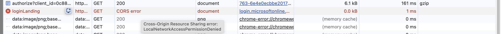
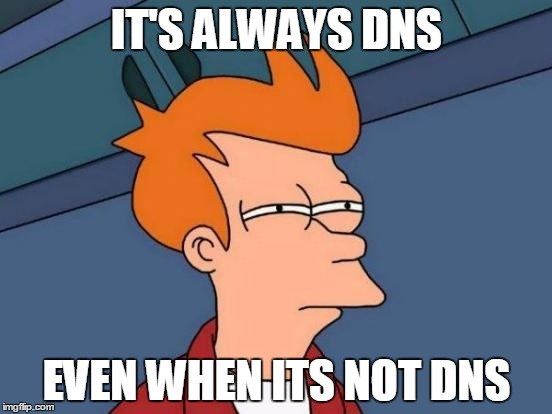

# About this lecture

I presented this lecture at the meetup of the DevOps community
on 2. 12. 2025 in Prague.

[Link to event](https://www.meetup.com/prague-devops-meetup/events/311867941/) (fallback [here](https://web.archive.org/web/20251106180202/https://www.meetup.com/prague-devops-meetup/events/311867941/)).

## How it started

On Monday everything works.

On Tuesday, we are getting first reports of "stuck automatic login" but we cannot reproduce it.

On Wednesday, more reports follow.

On Thursday, autologin is stuck for nearly everybody at the company.

What? How?

## Azure MSAL browser library

For automatic login, we use a library [@azure/msal-browser](https://github.com/AzureAD/microsoft-authentication-library-for-js/tree/dev/lib/msal-browser)
in the latest version [4.26.0](https://www.npmjs.com/package/@azure/msal-browser/v/4.26.0).

First, we try to log the user in automatically using [ssoSilent function](https://github.com/AzureAD/microsoft-authentication-library-for-js/blob/dev/lib/msal-browser/docs/login-user.md#silent-login-with-ssosilent). We expect the login to either work, or fail fast.

As a secondary means, we let the user to click a button to trigger the [loginPopup](https://github.com/AzureAD/microsoft-authentication-library-for-js/blob/dev/lib/msal-browser/docs/login-user.md#login-the-user).

## Demo time

Run the [demo app](./single-sign-on-demo/) locally, and show that the button is stuck in the "trying" state for a very long time.

- need to run in in the 142.0.7444.60 Chrome version: `"C:\Chrome-142.0.7444.60\chrome.exe" --disable-background-timer-updates --disable-component-update --disable-background-networking --disable-sync --user-data-dir="C:\Chrome-142.0.7444.60\UserData"`

- Might need to "reset Chrome settings" to demontrate the issue - [see later](#fishy-chrome)

## Diagnostic

First, we added logging. We get a not-so-helpful error from MSAL:

```
ssoSilent error: BrowserAuthError: monitor_window_timeout: Token acquisition in iframe failed due to timeout. For more visit: aka.ms/msaljs/browser-errors
```

In the network tab, we also get a weird network request failure that appears as "CORS" but is actually **LocalNetworkAccessPermissionDenied**.



So I spent about a day chasing a duck: I knew what CORS meant, and that the root cause _must_ be our server's configuration issue
(sending wrong HTTP headers). **This CORS error was the most confusing part** - the browser never even made the request to localhost, yet displayed it as a CORS failure!

But it turns out, CORS was no issue at all. By coincidence, a colleague read release notes of Chrome v142 and remembered that there was
a [new security feature](https://developer.chrome.com/release-notes/142#local_network_access_restrictions).

Note:

- on Windows Chrome [142.0.7444.60](https://chromium.googlesource.com/chromium/src/+/refs/tags/142.0.7444.60) instead of a weird CORS, they show a nice console error (sometimes):

```
Unsafe attempt to initiate navigation for frame with origin ... from frame with URL ... The frame attempting navigation of the top-level window is sandboxed, but the flag of 'allow-top-navigation' or 'allow-top-navigation-by-user-activation' is not set.
```

- on Windows Chrome [142.0.7444.135](https://chromium.googlesource.com/chromium/src/+/refs/tags/142.0.7444.135), the `ssoSilent` mostly works. Sometimes not. The [commit diff](https://chromium.googlesource.com/chromium/src/+log/142.0.7444.60..142.0.7444.135).

- related: [fishy chrome](#fishy-chrome)

## The root cause

A new browser feature - [Local network access restrictions](https://chromestatus.com/feature/5152728072060928).

When a website has a public IP address, it cannot make any requests to any private IP addresses.

But how does this all relate to our autologin feature?

## A bit of theory: OAuth2 Authorization Code flow with PKCE

Great guides are [here](https://www.oauth.com/oauth2-servers/single-page-apps/) and [here](https://www.oauth.com/oauth2-servers/pkce/authorization-request/).

1. Authorization request: GET [login.microsoftonline.com/.../authorize?](login.microsoftonline.com/.../authorize?)

   - `response_type=code` ... please give me a code I can later exchange for an access token
   - `response_mode=fragment` ... please put the code inside the URL fragment
   - `code_challenge`, `code_challenge_method` ... PKCE - client generates & saves a `code_verifier` and sends `code_challenge=base64Url(sha256(code_verifier))`
   - `client_id`, `scope`, `redirect_uri`, `state`

1. Microsoft verifies cookie and redirects to the `redirect_uri#code=...&state=...`

1. Exchange the `code` for an access token: POST [login.microsoftonline.com/.../token](login.microsoftonline.com/.../token)

   - `grant_type=authorization_code`
   - `code`
   - `code_verivier` from earlier (loaded e.g. from session storage)
   - `client_id`, `scope`, `redirect_uri`

## Behind the scenes

After reading a good amount of docs, I still did not know how `ssoSilent` works internally. So I started reading the source code of @azure/msal-browser.

First, `ssoSilent` [creates a hidden iframe](https://github.com/AzureAD/microsoft-authentication-library-for-js/blob/fad431f4c2f8b67f4db30bfa73ac2aeb13c54641/lib/msal-browser/src/interaction_handler/SilentHandler.ts#L247). The iframe points to [login.microsoftonline.com/.../authorize?...](https://login.microsoftonline.com/0b3e20b1-66a9-4a2e-8a1e-ac184cf6926d/oauth2/v2.0/authorize?client_id=814ba715-6611-4ab3-ae98-986378c48ef8&scope=User.Read%20openid%20profile%20offline_access&redirect_uri=http%3A%2F%2Flocalhost%3A5173%2Flogin-landing.html&client-request-id=019a5aae-ce11-7d81-a69e-4ee2db0261e6&response_mode=fragment&client_info=1&prompt=none&nonce=019a5aae-ce14-7621-ab55-ecafb38858d3&state=eyJpZCI6IjAxOWE1YWFlLWNlMTEtN2VjNS04NTAwLWExNjEzMTQ4OWUxZSIsIm1ldGEiOnsiaW50ZXJhY3Rpb25UeXBlIjoic2lsZW50In19&x-client-SKU=msal.js.browser&x-client-VER=4.26.0&response_type=code&code_challenge=5WmnpP4_CC-qKoBgSuJUMQw-XPxxzuPrHGXUjocUhFI&code_challenge_method=S256).

Then, `ssoSilent` [begins to regularly check](https://github.com/AzureAD/microsoft-authentication-library-for-js/blob/fad431f4c2f8b67f4db30bfa73ac2aeb13c54641/lib/msal-browser/src/interaction_handler/SilentHandler.ts#L117) - by [polling](https://github.com/AzureAD/microsoft-authentication-library-for-js/blob/fad431f4c2f8b67f4db30bfa73ac2aeb13c54641/lib/msal-browser/src/interaction_handler/SilentHandler.ts#L178) - the URL at which
the iframe currently is.

In the meantime, the iframe does its thing. After making a request to the [login.microsoftonline.com](login.microsoftonline.com), the iframe is redirected to the specified [redirectUri](./single-sign-on-demo/src/msalUtils.ts). The redirect itself is a `HTTP 302 Found` status code, with `Location` response header
in the form of [http://localhost:5173/login-landing.html#code=...&client_info=...&state=...&session_state=...](http://localhost:5173/login-landing.html#code=...&client_info=...&state=...&session_state=...).
The iframe tries to load the page.

But that's when the browser says `Oh I don't think so`. The [login.microsoftonline.com](login.microsoftonline.com) resolves to a **public** IP adress, whereas the [redirectUri](http://localhost:5173/login-landing.html) is on
the local network. So, we get a weird CORS error - or in the better case, a proper error message in the console.

Let me stress out once again how confusing the CORS error was. Usually, CORS errors are about your webserver, which doesn't send proper `Access-Control-Allow-Origin`
HTTP header. The browser is then like `Hmm, the author of the webserver doesn't want his content to be shared with other domains. OK, I will block it.`
But this one - it is completely different. The browser **did not** even **make** the request. So I naturally thought, `Hmm, it must be some OPTIONS requests.
Maybe they are cached?`...

Getting back to how the library works - if the redirect passses, then the URL of the iframe is changed. The `ssoSilent` function reads the URL, especially
its fragment part (behind the `#`). That is where the important information (`code`) is placed. Then, it proceeds with exchaning the code for a token - POST [login.microsoftonline.com/.../token](https://login.microsoftonline.com/0b3e20b1-66a9-4a2e-8a1e-ac184cf6926d/oauth2/v2.0/token?client-request-id=...)

But if nothing happens [for 10 seconds](https://github.com/AzureAD/microsoft-authentication-library-for-js/blob/fad431f4c2f8b67f4db30bfa73ac2aeb13c54641/lib/msal-browser/src/interaction_handler/SilentHandler.ts#L144), the `ssoSilent` just gives up and says `monitor_window_timeout: Hmm, it must be some browser-infra issue`.

## How to mitigate

Fail fast - decrease the timeout before the library gives up on monitoring the iframe.

```ts
const msalInstance = new PublicClientApplication({
  // ... other fields
  system: { iframeHashTimeout: 2000 },
});
```

## The resolution

Basically need to wait for upstream libraries.

[Github issue](https://github.com/AzureAD/microsoft-authentication-library-for-js/issues/8100).
[Pull request](https://github.com/AzureAD/microsoft-authentication-library-for-js/pull/8132).

The fix was very simple. That is, if you know all the details.

```ts
authFrame.setAttribute("allow", "local-network-access *");
```

Compare the generated iframes: [iframe v4.26.0](./single-sign-on-demo/src/iframe-v4.26.0.html) vs. [iframe v4.26.1](./single-sign-on-demo/src/iframe-v4.26.1.html)

The _v4.26.1_ usually asks for the user permission to access local networks.

But _sometimes_ the same error occurs. I do not know why - probably same reasons [as here](#fishy-chrome).

## Company-wide solution

We have internal applications. We don't want to force users to click "allow".

Solution: [`LocalNetworkAccessAllowedForUrls` policy](https://chromeenterprise.google/policies/?policy=LocalNetworkAccessAllowedForUrls).

This _should_ prevent the dialog. But when I tested it, the dialog was still present.

## Fishy Chrome

When preparing for this talk, I revealed some extemely strange behaviour affecting both refenced versions of Chrome.

1. Reset settings to Chrome defaults. This also deleted all cookies (logs out of microsoft).
1. Try the `ssoSilent` method. The [login.microsoftonline.com/...](login.microsoftonline.com/...) corretly responds with `302 Found` and the Location header `http://localhost:5173/login-landing.html#error=login_required&error_description=...`
1. The browser blocks the request with `CORS error - LocalNetworkAccessPermissionDenied`
1. As a result, there is a long `10 seconds` timeout (iframe could not navigate, main JS keeps polling)

So far, so good. But then refresh the page and:

1. Try again the `ssoSilent` method. Same response - redirect to localhost. Expected.
1. The browser **ALLOWS** the request
1. The `login-landing.html` page loads fast
1. **no 10s seconds** waiting (iframe navigates and main JS reads the fragment part)

In other words, there is different behaviour in the first and subsequent requests. Which should probably not be happeninng.  
I tried doing an [AI analysis](./AiChromiumAnalysis.md) of the releavant Chromium source code. But it mostly hallucinated.
However, there must be _some_ issue.

What is even more interesting - with the same Chrome version, on 2025-11-06, the requests were always blocked. On 2025-11-08 (just two
days later), this strange behaviour occured.



## Keywords

ssoSilent error, BrowserAuthError, monitor_window_timeout, local-network-access, LocalNetworkAccessPermissionDenied
