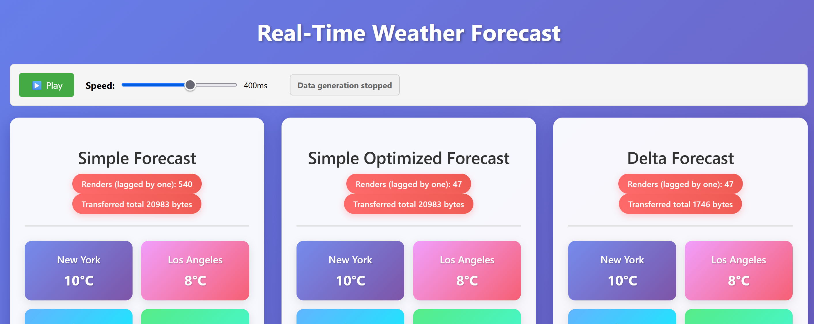

# About this lecture

I presented this lecture at the meetup of the Frontendisti community on 11. 2. 2026 in Prague (Alma Career).

[Link to event](https://www.meetup.com/frontendisti/events/313093149/) (fallback [here](https://web.archive.org/web/20260205133623/https://www.meetup.com/frontendisti/events/313093149/)).

## Motivation

Sometimes, you need to consume a live stream of realtime data in a web application. Most web apps use React nowadays.
If we want to have a well performing app, how do we approach this?

## Example domain

We will be displaying real-time feed of weather forecast data for different cities.

For simplicity of this demo, the data will be in this format:

```ts
type ForecastItem = { city: string; temperature: number };
type ToBeRendered = ForecastItem[];
```

The important thing is, the rendered data is an array of objects.

## Sneak peak: three working solutions

The rest of the talk will go over options how to implement this. They will differ
in speed and effectiveness.

Pay attention to the number of renders, and
the total number of transferred bytes.



## The backend

Our optimization options rely on whether we have control over the data source (producer of the data).

But even if we don't - we can write a backend service which we **have** control over, and which will
serve as a proxy with added features.

For the rest of discussion, let's assume we are the authors of both the front- and back-end.

For simplicity, our "backend" service is a "producer" ES module - but following a similar API a normal backend service would have.

## The straightforward solution

Whenever a change occurs, the server sends a new snapshot. We subscribe to this data source:

```tsx
export default function useWeatherForecast() {
  const [data, setData] = useState<ForecastItem[]>([]);

  useEffect(() => {
    const unsubscribe = subscribeForeast((newData) => {
      setData(parseForecast(newData));
    });
    return unsubscribe;
  }, []);

  return data;
}
```

And later, we render it:

```tsx
export default function SimpleForecast() {
  const data = useWeatherForecast();
  const renderCount = useRef(0);
  const onRender = useCallback(() => (renderCount.current += 1), []);

  return (
    <>
      <h2>Simple Forecast</h2>
      <div>CityForecast rendered {renderCount.current} times</div>
      {data.map((item) => (
        <CityForecast key={item.city} item={item} onRender={onRender} />
      ))}
    </>
  );
}
```

How fast do you think `renderCount` grows? And what if we memoize the `CityForecast` component? 🤔

The answer is:

- every `CityForecast` rerenders when **any** other forecast changes (default React behaviour - parent changes, all children rerender)
- memoization does **not** help, because the `item` is always a different reference
  - caused by `parseForecast` function - always new objects

So, if we want a better solution, what can we do?

## Preserving the reference

The fundamental issue is that we need to retain the same object **reference** for data that have not changed.

For unchanged items, we want to keep the previous JS object. So we will do just that.

When new data comes, we will deep compare (on the frontend) with the previous state.

If any of the props changes, we return the new data item. Otherwise, we keep the old.

```tsx
const parsed = parseForecast(newData);

setData((prev) => {
  // Deep compare each item, if same, do not change the reference
  const next = prev.map((item, index) => {
    const newItem = parsed[index]; // relying on the order of data

    if (
      item.city === newItem.city &&
      item.temperature === newItem.temperature
    ) {
      return item; // preserve reference
    } else {
      return newItem; // new reference
    }
  });

  return next;
});
```

This indeed helps to cut down the render counts to optimal values - we are rerendering **only** what
changed. Nothing more.

But it still seems kind of wasteful to send the whole new data over "the network", only to
take the changed items and throw the rest away. What can we do about that?

## The delta protocol

Why not move the "what changed" detection to the backend?

This means the backend does **not** send the entire data snapshot when something changes.
Instead, it sends only the thing which changed - the **delta** in the data.

Both the front-end and the back-end need to understand the meaning of the delta. Since our domain is simple, and the only possible operation
on the data is _changing the temperature value_ of some existing city, the delta protocol can also be simple.

```ts
type Message = { city: string; temperature: string };
```

Note: in a real-life scenario, you would like to have two message types: _upsert_ (insert or update) and _delete_ (e.g. city removed from the forecast).
More realistically, the messages would look like:

```ts
type UpsertMessage = { key: string; payload: ForecastItem };
type DeleteMessage = { key: string };
```

Let's assume the back-end has this already implemented. We will now add the support on the
front-end.

## Front-end delta client

A bit more code, but no magic here.

- first we fetch the entire data
- then we subscribe to deltas
- when a delta comes, we change only the affected city

```ts
useEffect(() => {
  let mounted = true;

  async function initialize() {
    const initialData = await getForecastData();
    if (!mounted) return;

    bytes += initialData.length;
    setData(JSON.parse(initialData) as ForecastItem[]);

    // FIRST need to get the snapshot, THEN can subscribe to deltas
    //  - a better design would not put this logic on the client - the server sends the snapshot first, then deltas
    //  - because this way, the client can miss some deltas between getting the snapshot and subscribing to deltas
    cleanupRef.current = subscribeForeast({
      type: "delta",
      callback: (delta) => {
        const parsedDelta = parseDelta(delta);

        setData((prevData) => {
          return prevData.map(
            (item) =>
              item.city === parsedDelta.city
                ? { ...item, temperature: parsedDelta.temperature }
                : item, // this line is crucial ... preserves the refence for unchanged items
          );
        });
      },
    });
  }

  initialize();

  return () => {
    mounted = false;
    if (cleanupRef.current) {
      cleanupRef.current();
    }
  };
}, []);
```

This approach **both** rerenders only what is needed, and saves data travelled over the network.

## Results

Suppose we have 30 cities for which we show data. For every changed city, we get:

- Simple approach
  - **30** renders
  - **30** \* itemSize bytes travelled over the network

- Simple optimized approach
  - **1** render for every changed city
  - **30** \* itemSize bytes travelled over the network

- Delta approach
  - **1** render for every changed city
  - **1** \* itemSize bytes travelled over the network

Now, I am not saying you need to implement the delta approach right away for everything.
For non-critical and slow data, simple approach might work just fine. And it's less code, too.

But for critical parts of your application, deltas might be just what you need.

## Keywords

Websockets React Performance Rendering, Real-time data, Delta protocol, React Memoization
